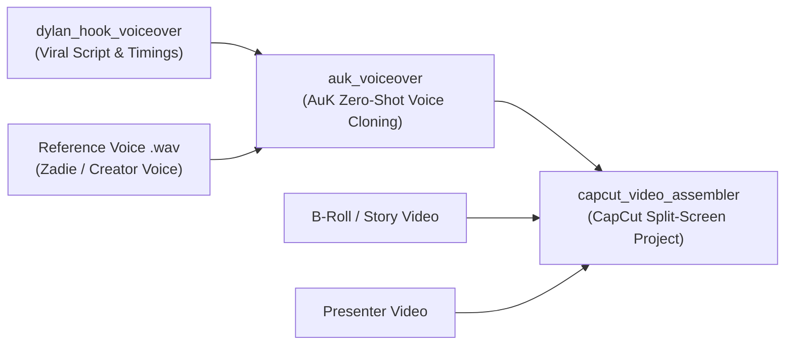

# /auk_voiceover

Synthesize high-fidelity, studio-quality voiceover audio from any spoken transcript using **AuK-Voice** (Tencent-Hunyuan 1.5B speech foundation model) running locally via **MLX** on Apple Silicon with unified memory acceleration.

Given any transcript and a short reference audio sample (even just 5–10 seconds of a speaking voice), `auk_voiceover` performs zero-shot voice cloning, matching the speaker's vocal timbre, pitch, cadence, and acoustic character.

---

## Resolve `SKILL_DIR`

Before running bundled scripts, resolve `SKILL_DIR`:

```bash
SKILL_DIR="<absolute path of directory containing this SKILL.md>"
```

All bundled scripts are located in `${SKILL_DIR}/scripts/`.

---

## Where It Fits in the Pipeline

This skill serves as the **dedicated audio synthesis bridge** in the AI video production pipeline:



1. **Script Engine**: `/dylan_hook_voiceover` crafts the hook, 4-beat structure, and calibrated cadence (`transcript.json` / `clean_voiceover.txt`).
2. **Audio Engine** (`/auk_voiceover`): Takes the script + reference voice and renders the spoken voiceover `.wav`.
3. **Assembly Engine**: `/capcut_video_assembler` loads the voiceover audio, subtitle track, story clip, and presenter track into CapCut Desktop.

---

## When to Use

- User has a transcript (`.txt`, raw text string, or `transcript.json`) and wants a realistic voiceover generated locally.
- User wants to clone a voice from a reference audio file (`.wav`, `.mp3`, `.m4a`).
- User wants to generate short viral hooks or longer scripts (25s, 45s, 60s+) without running into model sequence length limits (automatically chunked beat-by-beat or sentence-by-sentence).
- User wants offline, fast speech synthesis with zero cloud API costs.

---

## Input Parameters

| Parameter | Flag | Required | Default | Description |
|---|---|---|---|---|
| `--transcript` | `-t` | **Yes** | — | Transcript text string, path to `.txt` file, or path to `transcript.json`. |
| `--ref-audio` | `-r` | No | Zadie English `.wav` | Path to reference voice audio sample (5–10s clean mono WAV recommended). |
| `--output` | `-o` | No | `outputs/voiceover.wav` | Destination audio file path (`.wav`). |
| `--duration` | `-d` | No | *Auto* | Total target duration in seconds (computed from WPM if omitted). |
| `--wpm` | | No | `172.0` | Speaking rate in words per minute (172.0 aligns with viral short-form pacing). |
| `--engine` | | No | `flash` | AuK engine variant: `flash` (fast 4-step distilled DiT) or `base` (32-step ODE). |
| `--pause` | | No | `0.15` | Natural pause duration between sentence chunks / beats in seconds. |
| `--tone` | | No | *Neutral* | Vocal tone and emotion (e.g. `'energetic and excited'`, `'intense'`, `'dramatic'`). |
| `--seed` | | No | `42` | Random seed for deterministic generation. |
| `--json` | | No | `false` | Output structured timing JSON metadata to stdout. |

---

## Quick Start Examples

### 1. From a Plain Text String

```bash
python3 "${SKILL_DIR}/scripts/generate_voiceover.py" \
  --transcript "This might actually be the worst guard dog in human history." \
  --ref-audio "/Users/malickdes/AIWORKSPACE/AuK-Voice/assets/us-female/inworld-tts-2-flash_Zadie_English_09-18-2026 11-09-11.wav" \
  --output "outputs/quick_hook.wav"
```

### 2. From a Clean Transcript Text File

```bash
python3 "${SKILL_DIR}/scripts/generate_voiceover.py" \
  --transcript "/Users/malickdes/AIWORKSPACE/claude-video/work/dylan_dog_transcript_25s/clean_voiceover.txt" \
  --output "outputs/dog_25s_voiceover.wav"
```

### 3. From a Structured `transcript.json` (Recommended for Multi-Beat Scripts)

When passing a `transcript.json` generated by `dylan_hook_voiceover`, `auk_voiceover` automatically respects the pre-calibrated beat durations and stitches each beat together with natural conversational micro-pauses:

```bash
python3 "${SKILL_DIR}/scripts/generate_voiceover.py" \
  --transcript "/Users/malickdes/AIWORKSPACE/claude-video/work/dylan_dog_transcript_45s/transcript.json" \
  --ref-audio "/Users/malickdes/AIWORKSPACE/AuK-Voice/assets/us-female/inworld-tts-2-flash_Zadie_English_09-18-2026 11-09-11.wav" \
  --output "/Users/malickdes/AIWORKSPACE/claude-video/work/dylan_dog_transcript_45s/voiceover.wav" \
  --json
```

### 4. High-Energy / Viral TikTok Delivery

To achieve a fast, punchy, high-retention delivery with an energetic reference voice and tighter pauses:

```bash
python3 "${SKILL_DIR}/scripts/generate_voiceover.py" \
  --transcript "/Users/malickdes/AIWORKSPACE/claude-video/work/dylan_dog_transcript_45s/clean_voiceover.txt" \
  --ref-audio "/Users/malickdes/AIWORKSPACE/AuK-Voice/assets/us-female/Download.wav" \
  --tone "energetic and excited" \
  --wpm 188.0 \
  --pause 0.08 \
  --output "outputs/energetic_voiceover.wav"
```

---

## Checkpoints & Environment Setup

- **Model Checkpoints**: Checkpoint weights are stored on the local external drive volume `MacosApps` under `/Volumes/MacosApps/AuK-Voice/ckpts`.
- **Auto-Mount**: `generate_voiceover.py` automatically checks if `/Volumes/MacosApps` is mounted and attempts `diskutil mount disk18s3` if needed.
- **Unified Memory Acceleration**: AuK runs via Apple Silicon MLX (`auk_mlx`), utilizing the M-series GPU unified memory for sub-minute 4-step generation.
- **Python Environment**: `generate_voiceover.py` automatically detects whether dependencies are present in the caller's Python and transparently delegates into `/Users/malickdes/AIWORKSPACE/AuK-Voice/.venv` or `uv run`.

---

## Output Audio Specifications

- **Format**: PCM 16-bit WAV, mono
- **Native Sample Rate**: 24,000 Hz
- **Peak Normalization**: Automatically normalized to -0.8 dBFS to ensure broadcast-ready volume without distortion or clipping.
